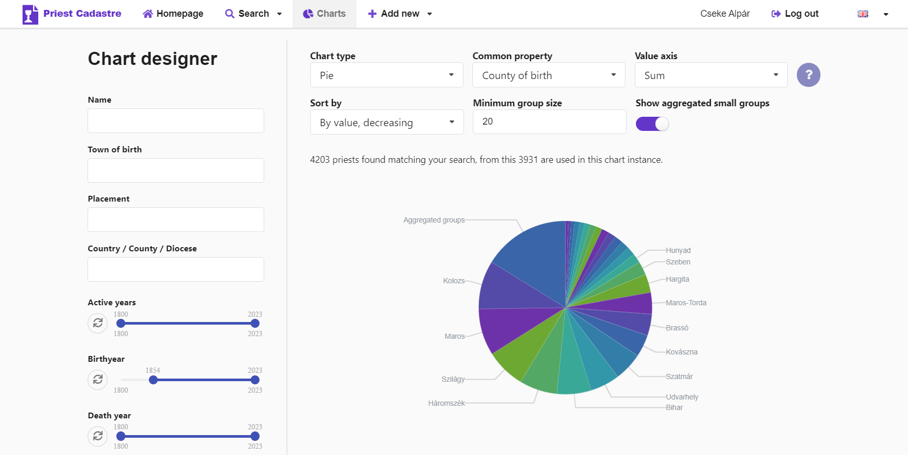

# cadastre-bachelors-thesis
My Bachelor's thesis application and papers. An interactive cadastre of priests for data analysis and visualization. 

### Repository structure:
- `code/repos/new` contains all code related to the application
    - `backend`: Golang REST API server connected to MongoDB
    - `frontend`: a React SPA
    - `deployment`: Helm chart for Kubernetes and a simpler docker-compose alternative for local setup
    - `tools`: data pre-processing scripts
- `paper` is for the papers submitted for my thesis and for two other conferences

### A screenshot from the live app

